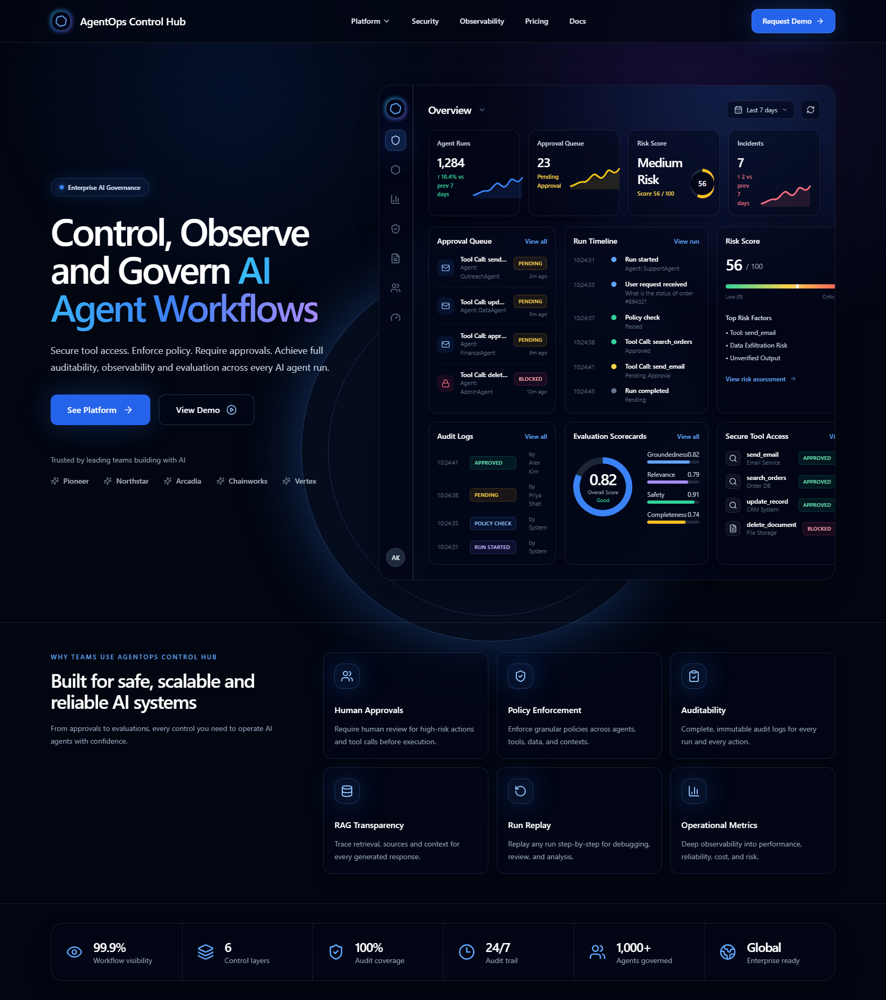

# AgentOps Control Hub

Ultra-premium SaaS landing page and interactive product preview for an AI agent governance platform.

AgentOps Control Hub presents a control layer for AI agent workflows: secure tool access, policy enforcement, human approvals, audit logs, observability, risk scoring, and evaluation scorecards.

[Live demo](https://danieloza.github.io/agentops-control-hub/)



## Highlights

- Premium dark enterprise SaaS landing page
- Embedded interactive dashboard preview
- Sidebar-driven dashboard views for overview, agents, metrics, policies, audit, approvals, and risk
- Working time range selector, refresh action, panel actions, and approval decisions
- Tooltip guidance for dashboard controls
- Responsive React + TypeScript + Tailwind implementation

## Tech Stack

- React
- TypeScript
- Vite
- Tailwind CSS
- lucide-react

## Local Development

```bash
npm install
npm run dev
```

Build:

```bash
npm run build
```

## Project Intent

This project is part of a practical AI systems portfolio focused on agent operations, governance, approvals, auditability, observability, and production-oriented control layers.
